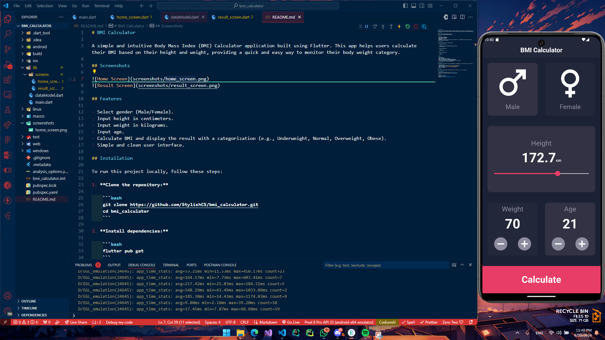
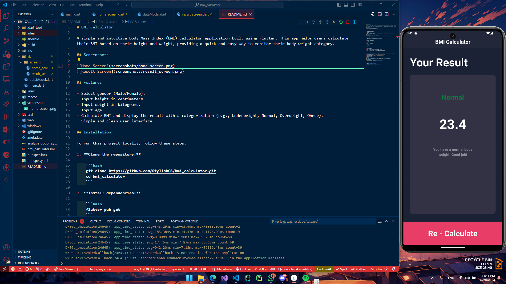

# BMI Calculator

A simple and intuitive Body Mass Index (BMI) Calculator application built using Flutter. This app helps users calculate their BMI based on their height and weight, providing a quick and easy way to monitor their body weight category.

## Screenshots




## Features

- Select gender (Male/Female).
- Input height in centimeters.
- Input weight in kilograms.
- Input age.
- Calculate BMI and display the result with a categorization (e.g., Underweight, Normal, Overweight, Obese).
- Simple and clean user interface.

## Installation

To run this project locally, follow these steps:

1. **Clone the repository:**

    ```bash
    git clone https://github.com/StylishCS/bmi_calculator.git
    cd bmi_calculator
    ```

2. **Install dependencies:**

    ```bash
    flutter pub get
    ```

3. **Run the application:**

    ```bash
    flutter run
    ```

## Usage

1. Open the app.
2. Select your gender.
3. Adjust the height using the slider.
4. Enter your weight using the increment/decrement buttons.
5. Enter your age using the increment/decrement buttons.
6. Press the "Calculate" button to view your BMI result and its category.
7. To recalculate, press the "Re-Calculate" button.

## Contributing

Contributions are welcome! If you have any suggestions or improvements, feel free to open an issue or submit a pull request.

1. Fork the project.
2. Create your feature branch (`git checkout -b feature/AmazingFeature`).
3. Commit your changes (`git commit -m 'Add some AmazingFeature'`).
4. Push to the branch (`git push origin feature/AmazingFeature`).
5. Open a pull request.

## License

This project is licensed under the MIT License. See the [LICENSE](LICENSE) file for details.

## Acknowledgements

- This project is built using [Flutter](https://flutter.dev/).
- Inspired by various BMI calculator designs available online.

## Contact

- **Author:** Your Name
- **Email:** <joeshirf@gmail.com>
- **GitHub:** [StylishCS](https://github.com/StylishCS)
